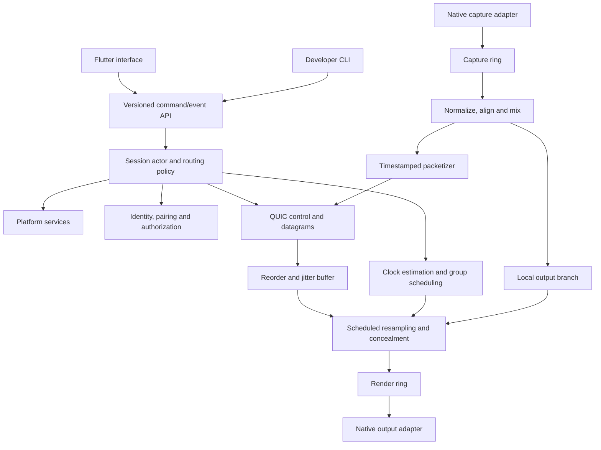

# Sonara — engineering and ecosystem plan

Sonara will ship first for Windows and Android, with a portable engine designed for a future macOS adapter.

The first release will provide two experiences:

- **Synchronized listening:** all participating outputs follow one presentation timeline.
- **Low-delay forwarding:** each output uses its lowest sustainable delay; alignment between outputs is not promised.

The ecosystem includes the apps, developer CLI, simulation and measurement tools, documentation, CI, and community releases. Connections use Wi-Fi, Ethernet, or USB tethering wherever devices have IP connectivity. No accounts, cloud services, telemetry, website, or internet relay are required.

## 1. Feasibility assessment

### What is achievable

| Capability | Assessment |
|---|---|
| Windows application capture | Supported through process-loopback APIs. |
| Windows system capture | Supported, with different semantics for endpoint capture and process-exclusion capture. |
| Several selected Windows apps | Capture distinct process trees and mix their timestamped streams. |
| Windows → Android or Windows | Feasible with native audio backends and LAN transport. |
| Android → Windows or Android | Feasible for capturable playback only. |
| Several synchronized receivers | Feasible; accuracy depends on clock estimation, output timestamps, and hardware. |
| Wired and wireless networking | Same protocol over available IP interfaces. |
| Background receiving | Feasible with platform-specific lifecycle handling. |
| Future macOS support | Feasible without replacing the shared engine. |

### Important limitations

**Capturing sound does not delay its original playback.** Sonara cannot make already-playing PC speakers wait for remote receivers. Driverless capture can synchronize Sonara-controlled outputs, but the original application output remains unmanaged.

For controlled local Windows playback, support a separately installed virtual audio device:

```text
Application → virtual endpoint → Sonara
                               ├─ physical PC output
                               └─ remote outputs
```

Sonara will not develop or distribute its own driver initially. The Windows app and installer may remain unsigned, as requested. New kernel drivers have different signing requirements and cannot be treated like unsigned desktop executables. [Microsoft driver-signing policy](https://learn.microsoft.com/en-us/windows-hardware/drivers/install/kernel-mode-code-signing-policy--windows-vista-and-later-)

**Android source playback has the same timing limitation.** Playback capture copies permitted audio without changing the source app’s latency. Source mode will therefore synchronize receiving devices, not automatically the source phone’s original speaker. Capture requires user permission, compatible usage, capture policy, and the same Android user profile. [Android playback capture](https://developer.android.com/media/platform/av-capture)

**Silence does not prove capture was blocked.** It can also mean the source is paused or silent. Explain possible restrictions without claiming certainty.

**Bluetooth is supported on a best-effort basis.** Its latency may be large, variable, and incompletely observable. Bluetooth routes will not qualify automatically for tight synchronization claims.

**Low latency and synchronized playback are different goals.** A shared group must accommodate its slowest admitted output. Neither mode can eliminate an external video player’s audio/video delay.

**This is a realtime-oriented pipeline, not a hard realtime guarantee.** Windows and Android can still introduce scheduling stalls.

## 2. Recommended technology stack

| Area | Choice | Reason |
|---|---|---|
| Shared engine | Rust, stable toolchain | Strong ownership, portable networking, testable state machines and DSP. |
| App interface | Flutter and Dart | Shared Windows/Android presentation with future macOS support. |
| UI state | Riverpod | Explicit asynchronous commands and observable engine state. |
| UI/native interface | Versioned C ABI, Dart FFI | Small controlled boundary; no audio samples pass through Dart. |
| Windows audio | Rust `windows` bindings and direct WASAPI | Required process capture, timestamps, device notifications, and buffering controls. |
| Android platform integration | Kotlin and JNI | Permissions, services, capture configuration, lifecycle, route discovery. |
| Android rendering | Oboe through a small C++ shim | Native low-latency playback and device compatibility handling. |
| Transport | Quinn, rustls, Tokio | QUIC datagrams and reliable encrypted control streams. |
| DSP | Rust with Rubato asynchronous resampling | Preallocated processing and adjustable sample-rate ratios. |
| Serialization | Protobuf control messages; fixed audio header | Extensible control protocol and compact media packets. |
| Discovery | Windows `mdns-sd`; Android `NsdManager` | Platform-appropriate DNS-SD discovery behind one interface. |
| Metrics | Atomic counters and off-thread `tracing` | Diagnostics without callback logging. |
| Optional codec | Reference `libopus` | Bandwidth-saving mode after PCM works. |
| Release tooling | GitHub Actions, CMake, Gradle, Inno Setup | Repeatable community builds and unsigned Windows installation. |

Flutter supports native platform integration, but it will own neither the audio pipeline nor Android service lifetime. [Flutter platform integration](https://docs.flutter.dev/platform-integration)

Oboe is the Android rendering choice; request low latency and exclusive sharing, then accept and report the actual configuration. [Android low-latency guidance](https://developer.android.com/games/sdk/oboe/low-latency-audio)

Rubato supports processing into caller-provided buffers. Benchmark its quality settings and processing delay before freezing the DSP configuration. [Rubato](https://github.com/HEnquist/rubato/)

### Alternatives

- **C++ core:** capable and mature, but Rust offers a better default for session, networking, and memory safety. Keep C++ limited to Oboe integration.
- **Pure Flutter plugins:** insufficient control over timing, capture semantics, and background ownership.
- **Tauri + Rust:** viable, but offers no audio advantage and is less aligned with the chosen shared mobile/desktop interface.
- **CPAL:** useful for generic audio applications, but it would not remove the need for direct platform code here. Do not use it in the production audio path.

Use MIT for Sonara’s code. Audit and retain dependency notices, including fonts, icons, native libraries, and transitive packages. Pin exact toolchain and dependency versions in the first build milestone rather than inventing version pins before compilation.

## 3. System architecture



The engine contains no Flutter, Windows handles, Android activities, or macOS framework objects.

### Core interfaces

- `CaptureBackend`: enumerate source capabilities, open capture, emit timestamped blocks and discontinuities.
- `RenderBackend`: enumerate routes, open output, expose frame-position/timestamp observations.
- `PlatformServices`: permissions, secure storage, lifecycle, discovery, network changes.
- `SessionEngine`: serialized commands, authoritative state, revisioned events.
- `Transport`: authenticated control messages, datagrams, connection status.
- `ClockEstimator`: maps peer monotonic clocks and reports uncertainty.
- `OutputScheduler`: converts source frame positions into local output deadlines.
- `AudioGraph`: bounded, explicitly owned source/mix/output topology.

Each device participates in **one active session**. It can host a source with local outputs, receive a remote source, or act as a controller. Remote audio cannot become a new source or relay in v1.

The source device is the session authority and reference clock. Host migration is deferred.

### Interface design

Desktop navigation: **Session, Devices, Diagnostics, Settings**.

The Session screen contains source selection, output rows, listening mode, buffering profile, and one primary Start/Stop action. Android emphasizes receiving, with a separate source workflow.

Follow the supplied Sonara tokens and Inter typography. Use restrained rows, thin separators, generous whitespace, accessible focus, and system/light/dark themes. The Codex influence is layout clarity and visual restraint, not copied assets.

“Synced” is a measured state. Unknown timing quality must remain visible.

## 4. Audio pipeline

### Source path

1. **Native capture:** acquire frames and the platform’s frame/timestamp observations.
2. **Capture ring:** copy into preallocated blocks; mark overflow and discontinuity.
3. **Clock mapping:** map capture frame positions to the host monotonic timeline.
4. **Normalization:** convert to float32 stereo at a logical 48 kHz.
5. **Mixing:** align selected sources by timestamp, apply Sonara-only gains, sum, and apply a bounded peak limiter.
6. **Packetization:** convert network samples to PCM16 and form timestamped packets.
7. **Fan-out:** reuse packet payloads across independent receiver connections.

Timestamps originate at capture, not when the network task happens to send.

A source endpoint running at another rate is resampled. Nominal “48 kHz” must not be treated as an exact hardware-clock frequency.

### Receiver path

1. Authenticate and validate the datagram.
2. Insert it into the bounded reorder buffer.
3. Resolve missing frames by the playback deadline.
4. Map source time to local presentation time.
5. Resample for output rate and clock correction.
6. Fill a short render ring.
7. Native callback consumes prepared frames.
8. Device timestamps estimate when those frames reach the output.

Internal float32 provides mixing headroom. PCM16 is the default wire format, so “same audio” means the same content and timeline, not bit-perfect delivery through every device.

Local outputs use the same scheduler as remote outputs, bypassing serialization and networking.

## 5. Networking architecture

Use **one QUIC connection per receiver**:

- Reliable bidirectional stream for commands and session configuration.
- Unreliable datagrams for audio and clock probes.
- Low-rate telemetry, kept separate from critical control processing.

QUIC datagrams avoid media retransmission while retaining encryption and congestion control. They can still be delayed by congestion; they are not a realtime delivery guarantee. [RFC 9221](https://www.rfc-editor.org/rfc/rfc9221)

Use Quinn’s nonblocking datagram-send path from networking tasks, never audio callbacks. Bound outgoing queues by a small duration and discard expired media instead of accumulating latency. Check the current datagram-size limit, which can change with the path. [Quinn connection API](https://docs.rs/quinn/latest/quinn/struct.Connection.html)

### Packet duration

| Duration | PCM16 stereo payload | Packets/second | Use |
|---|---:|---:|---|
| 2.5 ms | 480 bytes | 400 | Ultra Low |
| 5 ms | 960 bytes | 200 | Default |
| 10 ms | 1,920 bytes | 100 | Not a single default PCM datagram |

Default to **5 ms**. Fall back to 2.5 ms if the negotiated datagram limit cannot accommodate the full packet. Reject an unusably small limit; do not introduce application fragmentation in v1.

### Connections

- Wi-Fi, Ethernet, and USB tethering use identical protocols.
- Discover on eligible local interfaces; retain interface scope for IPv6.
- Provide manual address entry when discovery fails.
- Do not assume USB tethering always permits peer access or mDNS.
- Show the selected interface in diagnostics.
- Do not route a session silently onto cellular service.

No multicast media, NAT traversal, cloud rendezvous, TCP audio fallback, or direct USB accessory protocol.

RTP/SRTP would be defensible, but adds separate security/control integration. WebRTC brings useful internet features outside current scope. Custom encrypted UDP would increase security and congestion-control work without a demonstrated need.

## 6. Synchronization algorithm

### A. Source timeline

Each stream epoch defines:

- Source monotonic time domain.
- Frame index zero.
- Logical sample rate.
- Timestamped frame anchors.
- Presentation-delay revision.

Use monotonic clocks throughout. Suspend/resume invalidates timing estimates and starts a new epoch.

### B. Network clock estimation

For host timestamps `t1`, `t4` and receiver timestamps `t2`, `t3`:

```text
RTT = (t4 − t1) − (t3 − t2)
receiver_minus_host_offset = ((t2 − t1) + (t3 − t4)) / 2
```

Fit an affine mapping:

```text
receiver_time = a × host_time + b
```

Initial policy:

- Probe at 20 Hz during the first two seconds.
- Continue at 2 Hz while streaming.
- Keep a rolling 60-second history.
- Reject malformed exchanges, negative calculated RTT, and scheduling outliers.
- Fit using low-RTT samples, weighted regression, and residual rejection.
- Use offset-only estimation until enough time has elapsed to estimate skew.
- Report uncertainty; do not equate RTT/2 with known one-way delay.

Persistent network asymmetry remains an error source.

### C. Output-clock estimation

Poll platform frame-position/timestamp pairs outside callbacks. Fit:

```text
local_presentation_time = output_frame_position × seconds_per_frame + offset
```

Combine this mapping with the host/receiver clock mapping.

Windows exposes device-position/QPC information; Android AAudio exposes frame timestamps. Their existence does not establish acoustic accuracy on every route. [Windows device position](https://learn.microsoft.com/en-us/windows/win32/api/audioclient/nf-audioclient-iaudioclock2-getdeviceposition), [AAudio timestamps](https://developer.android.com/ndk/reference/group/audio)

Represent timing quality explicitly:

- Timestamp observed.
- Physically calibrated.
- Estimated.
- Unknown.

Apply a calibrated residual only for latency not already represented in the platform timestamp.

### D. Shared presentation delay

For a source frame captured at host time `T`:

```text
desired acoustic presentation = T + session_delay
```

Each receiver reports a minimum feasible delay including capture availability, packetization, network variation, DSP, output lead time, and uncertainty.

For synchronized listening:

```text
session_delay = round_up_to_5ms(maximum admitted receiver requirement)
```

Initial profile settings are engineering defaults, not guaranteed end-to-end latency:

| Profile | Packet duration | Network-jitter reserve floor | Automatic session-delay ceiling |
|---|---:|---:|---:|
| Ultra Low | 2.5 ms | 5 ms | 80 ms |
| Balanced | 5 ms | 15 ms | 150 ms |
| Stable | 5 ms | 40 ms | 300 ms |

Default: **Synchronized listening + Balanced**.

The ceiling does not force a device to play before it can. A device exceeding it is marked unable to join at that setting. Explicit user adjustment can accommodate slower routes, up to a one-second v1 limit.

### E. Group changes

- A new receiver measures its path before admission.
- It joins at the existing delay if feasible.
- Otherwise, offer a coordinated increase or keep it outside the group.
- A struggling output does not continuously raise everyone’s delay.
- If it cannot sustain the agreed timeline, fade it out and requalify it.
- Group delay changes use an acknowledged future epoch boundary and a short coordinated fade/rebuffer.
- Delay reductions happen on restart or explicit Optimize action.

Increasing the receive buffer alone must never silently make one synchronized output play later.

Low-delay mode instead assigns each output its own sustainable presentation delay.

### F. Drift controller

Let:

```text
e = predicted output presentation time − desired presentation time
```

Positive error means the output is late.

- Update the controller every 100 ms.
- Low-pass phase error over approximately one second.
- Estimate output-clock frequency drift separately as feed-forward.
- Apply a PI correction with anti-windup.
- Initial proportional gain: `0.05 s⁻¹`.
- Initial integral gain: `0.0005 s⁻²`.
- Limit normal total rate correction to ±500 ppm.
- Limit correction slew to 20 ppm per second.

Define the resampling control as source frames consumed per output frame: a positive correction consumes source audio faster to reduce lateness. Test this sign convention explicitly.

If phase error exceeds 20 ms for one second, timestamps become invalid, or the output loses its timeline, fade out, flush stale frames, reacquire timing, and restart at an announced boundary. Do not repeatedly drop or duplicate samples during healthy playback.

### G. Jitter and loss

Maintain a two-second rolling estimate of late arrival and required arrival margin. Grow the requested reserve rapidly after repeated deadline misses; reduce its estimate slowly after 30 seconds of stability.

For PCM loss, fade the last valid signal to silence over up to 2 ms and fade back when valid audio resumes. Avoid replaying arbitrary samples or blocking for retransmission.

Configure bounded storage up to the one-second maximum delay, but process only a short render horizon. Controller estimates may evolve; synchronized presentation changes remain coordinator-controlled.

## 7. Protocol design

### Versioning

- QUIC ALPN: `sonara/1`.
- `HELLO` exchanges protocol major/minor, features, device identity, and limits.
- Incompatible majors fail clearly.
- Optional minor-version features require capability negotiation.
- Application version and protocol version remain separate.

### Audio datagram header

Fixed 32-byte header, network byte order; PCM payload uses little-endian signed samples:

| Field | Size |
|---|---:|
| Version | 1 byte |
| Kind | 1 byte |
| Frame count per channel | 2 bytes |
| Stream ID | 4 bytes |
| Epoch | 4 bytes |
| Sequence number | 4 bytes |
| First frame index | 8 bytes |
| Source monotonic timestamp, nanoseconds | 8 bytes |

For default PCM, payload length must equal `frame_count × 2 channels × 2 bytes`.

Rate, channels, codec, sample representation, and presentation delay belong to reliable stream configuration, not repeated packet metadata. Format changes create a new epoch.

QUIC supplies authentication and integrity. Do not add a custom packet MAC or encryption scheme.

### Reliable messages

| Group | Messages |
|---|---|
| Negotiation | `HELLO`, `CAPABILITIES`, `ERROR` |
| Pairing | `PAIR_REQUEST`, `PAIR_ACCEPT`, `PAIR_REJECT` |
| Session | `SESSION_CREATE`, `SESSION_JOIN`, `SESSION_LEAVE`, `SESSION_STATE` |
| Preparation | `STREAM_CONFIG`, `OUTPUT_READY`, `START_AT` |
| Timing | `DELAY_PROPOSE`, `DELAY_ACK`, `EPOCH_COMMIT` |
| Recovery | `RESYNC_REQUEST`, `STOP`, `STOPPED` |
| Status | `DEVICE_STATUS`, `LATENCY_REPORT`, `BUFFER_REPORT` |

Use length-prefixed Protobuf messages with a 64 KiB frame limit. Commands contain request IDs and expected state revisions. Duplicate requests return their recorded result rather than repeating side effects.

Clock datagrams use probe IDs and timestamp fields. Complete exchanges feed the estimator; delayed or duplicate responses are discarded.

Stream ownership, origin device, and source selection are established on the authenticated control channel.

## 8. Platform implementation

### Windows

**Minimum runtime:** Windows 11, build 22000, x64. Test and publish support claims for maintained Windows releases.

Microsoft’s process-loopback sample requires build 20348 or later; this does not translate to ordinary Windows 10 22H2 support. [Application-loopback sample](https://learn.microsoft.com/en-us/samples/microsoft/windows-classic-samples/applicationloopbackaudio-sample/)

Use:

- `IMMDeviceEnumerator` and endpoint notifications for output devices.
- `IAudioSessionManager2` and session notifications for app candidates and activity.
- `ActivateAudioInterfaceAsync` with include-process-tree capture for selected apps.
- One capture stream per distinct selected tree; eliminate ancestor/descendant overlap.
- Exclude-Sonara-process-tree capture for system-wide capture.
- Endpoint WASAPI loopback only when its narrower endpoint semantics are requested and feedback safety is established.
- `IAudioClient3` shared-mode event-driven output, using supported periods.
- MMCSS registration for audio threads.
- Device clocks and capture timestamps for timing.

Process-exclusion capture and endpoint loopback are separate source types. Endpoint loopback does not provide arbitrary process exclusions. Protected audio is not guaranteed capturable. [WASAPI loopback](https://learn.microsoft.com/en-us/windows/win32/coreaudio/loopback-recording)

Preserve the source application’s volume settings. Sonara gain applies only to the copied signal; captured amplitude may still reflect platform/source volume behavior.

Use a native engine owner for tray operation, explicit Quit, optional login startup, and UI attachment. No system service is needed.

For the optional virtual-device workflow, document separately installed VB-CABLE as the initial interoperability target, while keeping endpoint integration generic. It remains an external dependency with its own license; do not bundle its installer. Verify the actual package signature during interoperability testing. [VB-Audio’s distribution page](https://vb-audio.com/Cable/)

Guide users to route selected apps through Windows sound settings. Do not depend on undocumented app-routing APIs.

### Android

**Minimum:** Android 10 / API 29. Release arm64 APKs; use x86_64 for emulator testing. Target the current stable SDK, presently API 37, with version-gated permissions.

Receiver:

- Kotlin-owned foreground service and native engine.
- Oboe callback output with actual configuration reporting.
- Route enumeration and change callbacks through `AudioManager`.
- Request a route where supported; display the actual route.
- Media playback notification, Stop action, and audio focus handling.
- No Dart dependency after streaming starts.
- Wi-Fi or partial wake locks only during an active session when testing establishes need.

Source:

- User-initiated `MediaProjection` consent.
- `AudioRecord` with playback-capture configuration.
- UID filtering for selected visible apps.
- Dedicated capture thread using reusable buffers.
- Source capture does not request playback focus that would pause the captured app.
- Exclude Sonara’s UID where appropriate and prevent capture of Sonara’s received playback.

Do not claim complete installed-app visibility or Windows-style audio-session enumeration on Android.

Handle projection revocation as a normal state transition. Screen-lock and projection behavior require tests on both Samsung phones; current Android documentation describes automatic stopping of screen projection on lock, so uninterrupted source capture must not be promised. [MediaProjection lifecycle](https://developer.android.com/media/grow/media-projection)

Handle Android’s local-network permission requirements, including denial and revocation. [Local-network permission](https://developer.android.com/privacy-and-security/local-network-permission)

Use the appropriate active foreground-service type and handle focus loss. Newer Android releases restrict background audio operations. [Android background audio](https://developer.android.com/about/versions/17/changes/bg-audio)

### Future macOS

Plan for macOS 14.2+:

- Core Audio process taps for application/group/system audio.
- Core Audio rendering, device enumeration, and hardware-clock observations.
- Swift/Objective-C++ adapter where needed.
- ScreenCaptureKit as a researched alternative for capture/filtering.
- Platform permission and secure-storage integration.

Core Audio taps can capture groups of processes and support muting tapped process output, making them particularly relevant to controlled local playback. [Apple Core Audio taps](https://developer.apple.com/documentation/coreaudio/capturing-system-audio-with-core-audio-taps)

ScreenCaptureKit also supports audio capture and filtering. [Apple capture sample](https://developer.apple.com/documentation/screencapturekit/capturing-screen-content-in-macos)

Reuse protocol, transport, pairing, DSP, synchronization, simulation, session logic, and most Flutter UI. Implement no macOS backend during the Windows/Android milestones.

## 9. Security and pairing

### Discovery

Advertise `_sonara._udp.local` with minimal metadata: display name, protocol major, and endpoint information.

Discovery is untrusted. A name or IP address never establishes identity.

Advertise while the app is available for connection or has an active session; Android will not maintain an idle permanent service merely for discovery.

### Pairing

Use locally generated persistent identities with TLS certificates.

Initial pairing uses a QR invitation containing:

- Protocol version.
- Host endpoint candidates.
- Host public-key fingerprint.
- Cryptographically random 256-bit one-time token.
- Invitation identifier.

The host enforces a two-minute expiry using its own clock.

The receiver pins the host key before presenting the token over TLS. The host explicitly approves the joining device and stores its presented identity; both devices then reconnect using pinned mutual authentication.

Provide a copyable invitation string for manual-address workflows. Do not make an IP address or unauthenticated six-digit code sufficient to pair.

Tokens are single-use, omitted from logs, and invalidated on completion or cancellation. Pairing endpoints are rate-limited and cannot access streaming operations.

### Trust and authorization

- Pairing does not automatically authorize every future session.
- Default to explicit session approval.
- Optional auto-reconnect applies only to trusted peers and eligible active sessions.
- No automatic Android capture permission bypass.
- No 0-RTT control operations in v1.
- Revocation immediately closes connections and removes local trust.
- A changed identity requires pairing again.

Protect private key material with Windows DPAPI or Android Keystore-backed encryption. Do not claim a Rust-loaded private key is hardware-bound.

No microphone recording, stored audio, remote control of unrelated applications, or telemetry is enabled implicitly.

## 10. Repository structure

```text
Sonara/
├─ README.md
├─ LICENSE
├─ CONTRIBUTING.md
├─ SECURITY.md
├─ Cargo.toml
├─ Cargo.lock
├─ rust-toolchain.toml
├─ deny.toml
├─ apps/
│  ├─ sonara/
│  │  ├─ lib/
│  │  │  ├─ app/
│  │  │  ├─ features/
│  │  │  └─ design_system/
│  │  ├─ windows/
│  │  ├─ android/
│  │  └─ pubspec.yaml
│  ├─ cli/
│  └─ android-probe/
├─ packages/
│  └─ sonara_engine/
│     ├─ lib/
│     ├─ include/
│     └─ native/
├─ crates/
│  ├─ engine/
│  ├─ session/
│  ├─ audio/
│  ├─ dsp/
│  ├─ sync/
│  ├─ protocol/
│  ├─ transport/
│  ├─ security/
│  ├─ discovery/
│  ├─ diagnostics/
│  ├─ platform/
│  ├─ platform-windows/
│  ├─ platform-android/
│  └─ simulation/
├─ native/
│  └─ android/
│     ├─ kotlin/
│     └─ oboe-shim/
├─ protocol/
│  ├─ control.proto
│  └─ golden/
├─ tests/
│  ├─ integration/
│  ├─ scenarios/
│  ├─ fixtures/
│  └─ hardware/
├─ tools/
│  ├─ bootstrap/
│  ├─ measurement/
│  └─ packaging/
├─ assets/
│  ├─ brand/
│  ├─ fonts/
│  └─ icons/
├─ docs/
│  ├─ architecture/
│  ├─ decisions/
│  ├─ protocol/
│  ├─ platforms/
│  ├─ testing/
│  ├─ brand/
│  └─ releases/
└─ .github/
   └─ workflows/
```

One Flutter application produces both platforms; do not duplicate the interface into separate apps.

The Android probe is a minimal development shell, not a second product. Document future macOS contracts without creating an empty pretend implementation.

## 11. Threading model

| Thread/task | Responsibilities |
|---|---|
| Flutter UI | User interactions, views, settings, throttled metrics. |
| Session actor | Serialized commands, state, permissions, routing decisions. |
| Native capture thread | Read frames/timestamps and write bounded capture ring. |
| Source DSP worker | Normalize, align, mix, packetize. |
| Network runtime | QUIC, encryption, probes, control, peer fan-out. |
| Receiver DSP worker | Reorder, conceal, resample, prepare output frames. |
| Native output callback | Consume prepared frames; fill silence on underrun. |
| Timing task | Poll device timestamps and update clock models. |
| Diagnostics task | Read counters, aggregate metrics, write optional logs. |

Callback rules:

- No allocation/free, blocking locks, network, disk, logging, Dart, or JNI calls.
- No resource destruction or stream reopening.
- Preallocated single-producer/single-consumer rings.
- Atomic counters and immutable configuration snapshots.
- All streams close on lifecycle/control threads.
- FFI catches failures at the boundary; no Rust unwind crosses C/JNI.
- Diagnostics update the interface at 2 Hz by default.

Use bounded queues everywhere, including reliable control input.

## 12. Failure and recovery model

Use separate session, peer, and discovery/pairing states rather than one flat state machine.

```text
Session:
Idle → Preparing → Synchronizing → Streaming
                       ↑              ↓
                       └── Recovering ┘
Any active state → Stopping → Idle
Unrecoverable failure → Error
```

Peers independently move through Connecting, Authorizing, Preparing, Ready, Streaming, Recovering, and Offline.

Every operation carries an epoch/generation so late callbacks cannot revive an obsolete session.

| Failure | Required behavior |
|---|---|
| Brief packet loss | Conceal by deadline; keep timeline. |
| Wi-Fi interruption | Fade affected output, discard stale audio, reconnect with backoff. |
| IP/interface change | Reconnect using identity; remeasure timing before playback. |
| Source process exits | Pause source and show unavailable; never silently capture another PID. |
| Source restarts | Offer/reapply selection only after executable identity validation. |
| Explicit output unplugged | Stop that output; do not unexpectedly switch headphones to speakers. |
| Follow-default output changes | Reopen the selected default route and requalify timing. |
| Bluetooth route changes | Invalidate latency estimates and calibration. |
| Android focus loss | Pause/fade the receiver; reacquire before resuming. |
| Projection permission revoked | Stop capture and request fresh user action. |
| Host suspend/resume | New epoch, fresh clocks, no stale packet playback. |
| Receiver freezes | Isolate it; remaining group continues. |
| Host crash | Receivers fade to silence; no host migration. |
| Clock/timestamp failure | Degrade timing status or resynchronize; never report false certainty. |

Reconnect after approximately 0.5, 1, 2, 4, then 8 seconds with jitter, for up to one minute. Continue discovery afterward without silently restarting an ended session.

## 13. Testing strategy

### Unit and protocol

- Packet sizes, bounds, endian encoding, sequence wrap, epoch rejection.
- Version negotiation and golden wire fixtures.
- Invalid, oversized, duplicate, and stale commands.
- Mixing, clipping protection, channel conversion, and source overlap.
- FFI ownership, shutdown, cancellation, and repeated start/stop.
- Pairing replay, expired invitations, changed identities, and revoked peers.

### Deterministic simulation

Use a virtual clock and seeded network model:

```text
sonara dev simulate --scenario tests/scenarios/good-lan.toml
```

Cover:

- Receiver drift of +100 ppm and −80 ppm.
- Capture-clock drift independent of host monotonic time.
- 5 ms jitter, reordering, 1% loss, and burst loss.
- Fixed asymmetric delays.
- Clock observation noise and timestamp outages.
- Joining/leaving outputs.
- Congestion and bounded queue pressure.
- Delay changes, suspend, and epoch resets.

Under the symmetric good-LAN simulation, target p95 alignment below 1 ms after convergence and no unbounded occupancy growth over a simulated hour. Asymmetric cases must expose uncertainty rather than pass a misleading accuracy assertion.

### Physical measurement

Use a shared multichannel recorder/interface for simultaneous output measurements where possible:

1. Emit a known coded pulse/chirp sequence.
2. Record outputs on a common sampling clock.
3. Estimate offsets using cross-correlation.
4. Repeat at least 500 events over 30 minutes.
5. Report p50/p95/p99/max skew, drift, missing events, and confidence.

For speaker-only testing, account for microphone distances and room reflections. A single mixed microphone recording cannot always distinguish identical simultaneous signals; use separate channels or distinguishable diagnostic sequences.

Measure capture-to-output latency separately using a simultaneous source reference. Do not label network timings as DAC latency.

Initial hardware matrix:

- Your Windows PC.
- Galaxy S24.
- Galaxy S20 FE.
- Speakers, plus wired/USB/Bluetooth routes that are available.
- Wi-Fi and USB tethering.
- macOS testing deferred.

Record actual phone OS versions, router, audio routes, and device processing settings before measurements. A shared recorder is a later test dependency, not assumed available.

### Reliability

- Eight-hour streaming soak.
- One hundred connect/start/stop cycles.
- Screen off/on, interruptions, app closure, permission revocation.
- Network and route changes during playback.
- Clean install, upgrade, uninstall, and retained trust/settings.
- Dependency/license audit, protocol fuzzing, and secret-redaction checks.

## 14. Performance budget

These are acceptance goals and investigation thresholds, not advertised hardware guarantees.

### Network

Default PCM:

```text
48,000 × 2 channels × 16 bits = 1.536 Mbit/s per receiver
```

At 5 ms:

- 200 audio datagrams/second/receiver.
- 960-byte payload plus 32-byte Sonara header.
- Approximately 1.7–2.0 Mbit/s before Wi-Fi link-layer overhead and retransmissions.
- Three receivers: approximately 5.1–6.0 Mbit/s.
- Encryption and transmission remain per connection, even when payloads are reused.

### Initial latency allocation

| Contributor | Initial investigation range |
|---|---:|
| Native capture availability | 3–20 ms |
| Packet accumulation | Up to 5 ms |
| Source/receiver DSP | 1–5 ms, plus measured resampler delay |
| Healthy local network | 1–10 ms, measured rather than assumed |
| Network reserve | Profile-dependent |
| Native output and device | 5–40+ ms; Bluetooth may be substantially higher |

The components overlap in some APIs. Measure the total path rather than blindly adding all reported values.

### Release goals

| Metric | Initial goal |
|---|---|
| Physical inter-output skew | p95 ≤5 ms on qualified non-Bluetooth routes |
| Skew if tight goal is missed | Publish measured limitation; do not call the route precision-qualified |
| Low-delay capture-to-output | Investigate ≤60 ms on qualified hardware |
| Balanced synchronized path | Investigate ≤100 ms on qualified hardware |
| Initial synchronization | Within 3 seconds on a healthy LAN |
| Rejoin after connectivity returns | Within 5 seconds under healthy conditions |
| Healthy playback underruns | Zero during a 30-minute qualification run |
| Windows engine CPU | Below 10% of one logical core for three PCM receivers |
| Android engine CPU | Below 15% of one core equivalent while receiving |
| Engine memory | Below 64 MiB steady-state; UI measured separately |
| Callback execution | p99 below 25% of the callback period |
| Memory growth | No sustained growth during eight-hour soak |

Report battery drain and temperature over matched screen-off trials on both phones. Establish a numeric battery target from that baseline.

For optional Opus, begin with restricted-low-delay, 5 ms frames, stereo, and 160 kbit/s. Query and account for codec lookahead; do not claim it is delay-free. [Opus encoder controls](https://www.opus-codec.org/docs/opus_api-1.6/group__opus__encoderctls.html)

## 15. Milestone roadmap

Every milestone produces a runnable artifact, test evidence, updated documentation, and recorded limitations.

| Milestone | Implementation | Tests and performance gate | Definition of done |
|---|---|---|---|
| **0 — Foundation and probes** | Pin toolchains; MIT license; CI; Windows capture/timestamp probe; Oboe probe; device inventory. | Both phones render test audio; PC captures selected process; timing observations recorded. | Clean-checkout builds succeed and capability report exists. |
| **1 — Local audio engine** | Windows capture, normalization, process mixing, local output, virtual-endpoint interoperability. | 30-minute stable run; bounded buffers; source volume settings unchanged; feedback tests pass. | CLI supports source/output enumeration and controlled local playback. |
| **2 — Secure network POC** | Pinned identity/invitation pairing, QUIC PCM, minimal Android receiver service, initial clocks and drift control. | PC → S24 for 30 minutes; no unauthenticated stream; timestamp and latency report. | End-to-end architecture demonstrated before full UI. |
| **3 — Timing qualification** | Simulator, output-clock mapping, PLL, jitter adaptation, physical measurement scripts. | Simulation goals pass; physical skew measured; hard-resync and loss cases verified. | Timing algorithm accepted or measured limitation documented before expansion. |
| **4 — Multiple outputs and modes** | S24 + S20 FE; local controlled output; synchronized/low-delay modes; profile policy. | Join/leave and slow-peer isolation; three-output run; CPU/bandwidth measured. | Both modes behave predictably with independent peer recovery. |
| **5 — Windows product behavior** | Dynamic source list, source persistence, route changes, tray, login startup, guided virtual routing. | Restart, unplug, default-device, and feedback matrix. | Desktop engine operates reliably without an open UI. |
| **6 — Discovery and pairing UX** | DNS-SD, QR/manual invitations, trust list, revocation, permission flows. | Discovery across Wi-Fi/tethering; expiry/replay/MITM identity tests; no audio before authorization. | Non-developers can pair, reconnect, and revoke devices. |
| **7 — Android source** | Playback capture, UID selection, projection lifecycle, source-to-Windows/Android. | Capturable fixture works; restricted/silent fixture handled honestly; lock/revocation tests. | Supported source behavior documented for both phones. |
| **8 — Production interface** | Flutter screens, brand system, accessibility, themes, diagnostics/export, notifications. | UI/engine lifecycle independence; keyboard/text-scaling tests; memory budgets measured. | Complete Windows/Android user journeys work without developer tools. |
| **9 — Bandwidth and release hardening** | Optional Opus, eight-hour soak, packaging, checksums, SBOM, release guide. | Codec-delay accounting; clean install/update; dependency and hardware matrix. | Tagged community preview with Windows installer and signed Android APK. |

macOS follows these milestones as a separate adapter project. It is not part of the initial delivery gate.

No calendar estimate is fixed before Milestone 2 establishes hardware behavior and development throughput.

## 16. POC specification

Build a Windows CLI and a minimal Android probe app. Android permissions and services make a literal standalone receiver CLI unsuitable as the normal prototype entry point.

Illustrative Windows commands:

```text
sonara devices
sonara sources
sonara pair invite
sonara host --pid 1234 --mode synchronized --profile balanced
sonara receive --invitation <invitation>
sonara dev simulate --scenario tests/scenarios/good-lan.toml
sonara diagnostics export --output run.json
```

The Android probe provides:

- Import/scan invitation.
- Connect and start receiving.
- Start/stop foreground service.
- Actual route, buffer, timestamp quality, drift, RTT, and loss.
- Export local diagnostics.

POC scope:

- One selected Windows process.
- One Android receiver.
- PCM16, stereo, 48 kHz, 5 ms packets.
- Encrypted authenticated transport from the first network prototype.
- Clock exchange, bounded jitter buffer, continuous rate correction.
- Screen-off receiving.
- Timestamped measurements and deterministic simulation.

Exclude final UI, discovery automation, multiple source mixing, Android capture, Opus, Bluetooth qualification, and macOS.

The original Windows speaker output is outside the POC synchronization claim unless its audio is explicitly routed through a controlled virtual endpoint.

POC exit requires a repeatable 30-minute run and measured timing results. Hearing audio once is insufficient.

## 17. Risk register

| Severity | Risk | Mitigation |
|---|---|---|
| Critical | Original playback cannot be delayed by capture APIs | Explicit unmanaged/controlled distinction; optional separately installed virtual endpoint. |
| Critical | Device timestamps do not match acoustic presentation closely enough | Hardware qualification, residual calibration, uncertainty reporting, honest route status. |
| High | Android source blocked or stopped by platform policy | Supported APIs only; explicit consent; lifecycle tests; restricted capability messaging. |
| High | Wi-Fi asymmetry biases clock estimates | Low-RTT filtering, uncertainty bounds, wired reference measurements. |
| High | Bluetooth delay varies or remains hidden | Best-effort status, route-specific calibration, explicit shared-delay admission. |
| High | OS scheduling causes stalls | Short bounded callbacks, native threads, stress/soak tests, concealment. |
| High | Feedback through system capture | One-session restriction, no relay, self-exclusion, route validation, fail-closed unsafe topology. |
| High | Pairing trusts spoofed discovery | Pinned invitations, one-time secrets, mutual identity, explicit authorization. |
| Medium | Rust/C++/Kotlin/Dart lifecycle bugs | Narrow ABI, single engine owner, generation IDs, teardown stress tests. |
| Medium | Unsigned Windows release causes installation friction | Clearly label publisher/signing status; hashes and provenance; no security-setting changes required by Sonara. |
| Medium | Optional cable has separate licensing/distribution rules | External installation only; generic endpoint support; no bundled proprietary driver. |
| Medium | Flutter overhead affects older devices | Native background operation, throttled UI metrics, phone-specific profiling. |
| Medium | “Synced” overstates precision | Gate status by lock and timing confidence; publish measured device results. |

Routing validation rejects cycles in the modeled graph. It cannot detect every external cable or third-party mixer configuration, so unsafe endpoint capture/output combinations remain disallowed unless their separation is established.

The core is designed for evolution, not a promise that no later redesign will ever be necessary.

## 18. Decisions

| Decision | Choice | Why | Alternatives rejected |
|---|---|---|---|
| Core language | Rust | Portable, testable engine with strong ownership | Full C++ core |
| Interface | Flutter | Shared Windows/Android UI and future macOS reuse | Tauri, independent native UIs |
| Realtime boundary | Native engine only | Isolates audio from UI scheduling | Dart audio processing |
| Audio abstraction | Direct platform adapters | Required capture and clock controls | CPAL production path |
| Windows baseline | Windows 11 x64 | Process-loopback support and manageable test scope | General Windows 10 support |
| Android baseline | API 29+, arm64 release | Playback-capture availability | Older Android source support |
| Windows app capture | Distinct process trees, timestamped mixing | Avoids arbitrary multi-PID assumptions | One nonexistent arbitrary-app capture call |
| Android capture | MediaProjection + AudioRecord | Supported and policy-respecting | Capture bypasses |
| Android output | Oboe | Native low-latency control | Flutter playback plugin |
| Transport | QUIC datagrams + reliable streams | Encryption, control, and media in one connection | TCP audio, custom encrypted UDP |
| LAN format | PCM16 stereo at 48 kHz | Predictable low codec overhead | Mandatory Opus |
| Internal format | Float32 stereo | Mixing and DSP headroom | Integer-only DSP |
| Packet duration | 5 ms; 2.5 ms Ultra Low | MTU fit and scheduling balance | Default 10 ms PCM datagrams |
| Clock model | Affine monotonic mapping | Estimates offset and frequency skew | Arrival-time playback |
| Drift correction | Bounded asynchronous resampling | Continuous correction | Repeated sample dropping |
| Group timing | Shared presentation delay | Output alignment | Independent delay in synchronized mode |
| Low-delay mode | Per-output delay | Responsiveness | Group synchronization promise |
| Hardware latency | Timestamp model plus calibrated residual | Avoids guessing and double counting | RTT presented as total latency |
| Bluetooth | Best effort, explicit admission | Variable output timing | Universal precision claim |
| Discovery | DNS-SD plus manual invitation | LAN usability with fallback | Multicast-only connectivity |
| Pairing | Pinned QR/copyable invitation | Authenticated account-free setup | Unverified discovery or raw six-digit trust |
| Feedback protection | Single session, no relay, self-exclusion | Reduces topology and capture risks | Arbitrary v1 routing graph |
| Reconnection | Trusted identity, fresh timing | Avoids stale playback | Blind resume |
| Local virtual device | Optional existing external device | Honors no-certificate constraint | New unsigned production driver |
| Distribution | Unsigned Windows installer; developer-signed APK | Community distribution without Microsoft certificate | Store-first launch |
| Privacy/license | No telemetry; MIT project | User-selected defaults | Accounts and cloud dependency |
| macOS | Future native adapter | Reuses shared engine and UI | First-release implementation |
| First implementation | Probes, CLI, minimal Android receiver | Proves the difficult audio assumptions early | Full interface before timing works |

